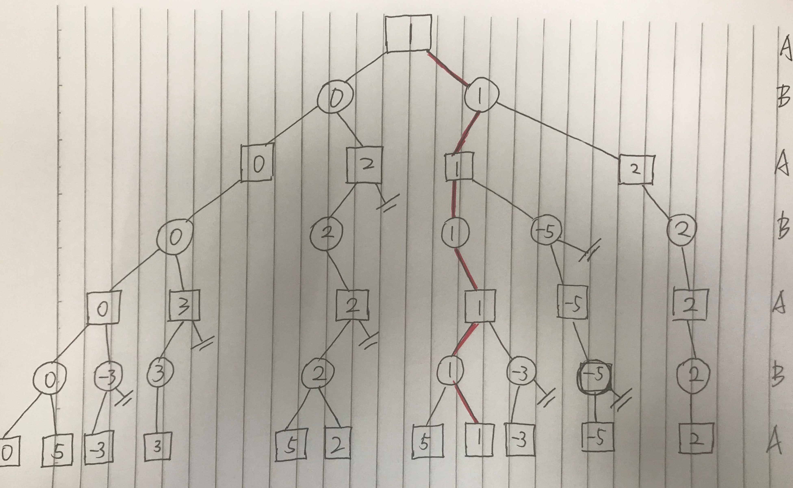
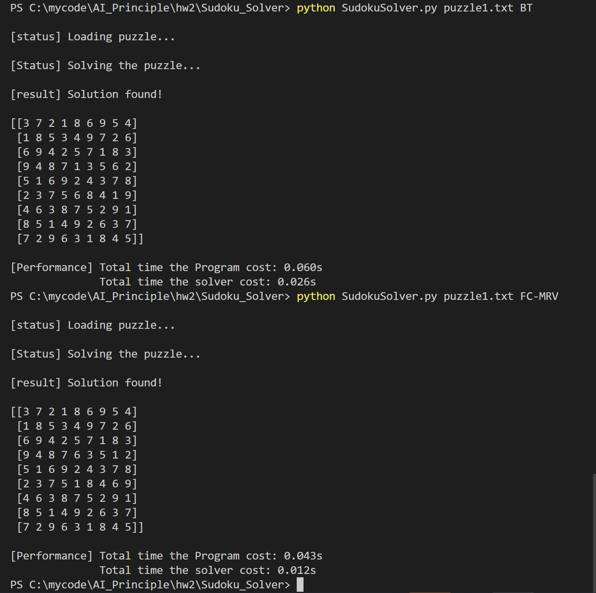
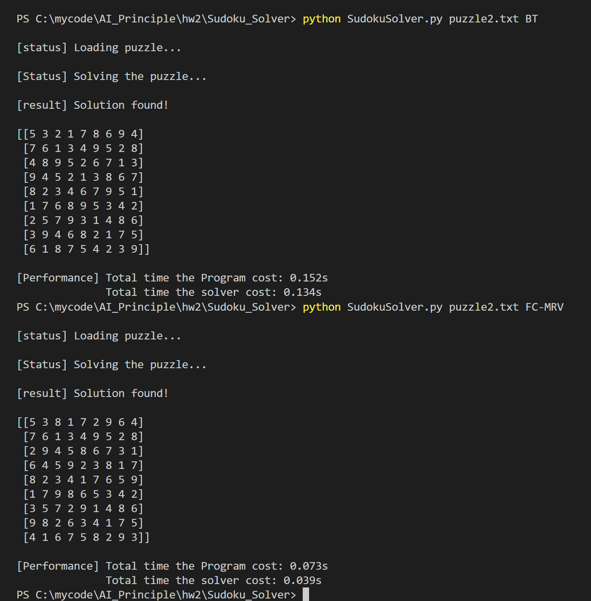
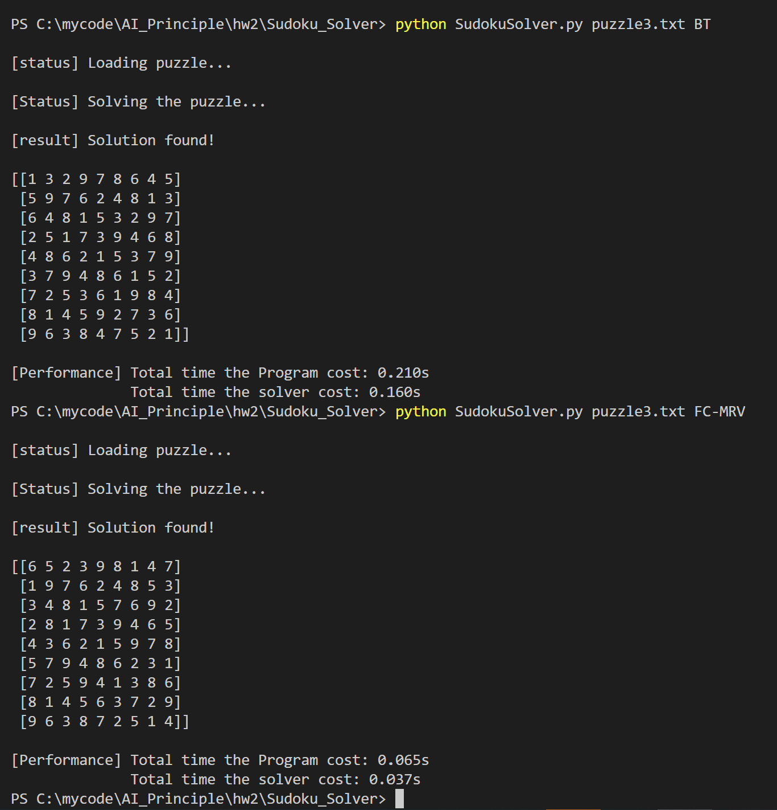
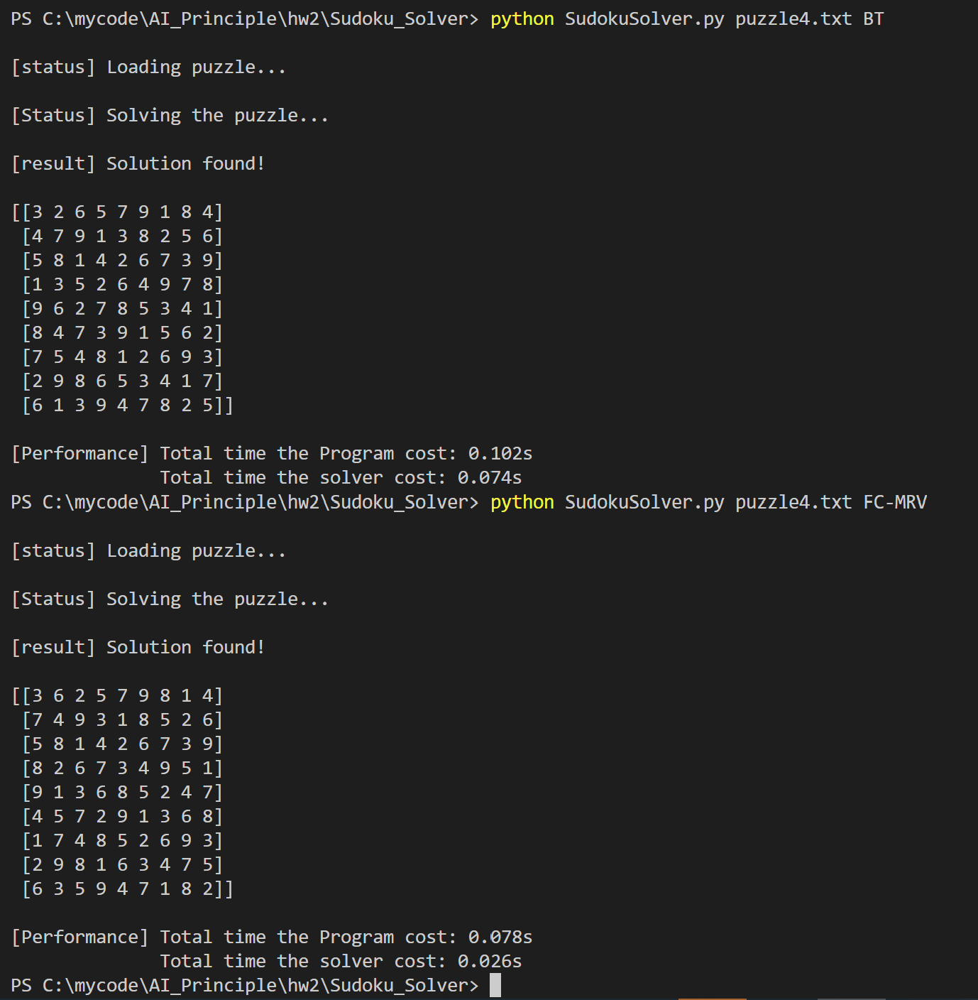
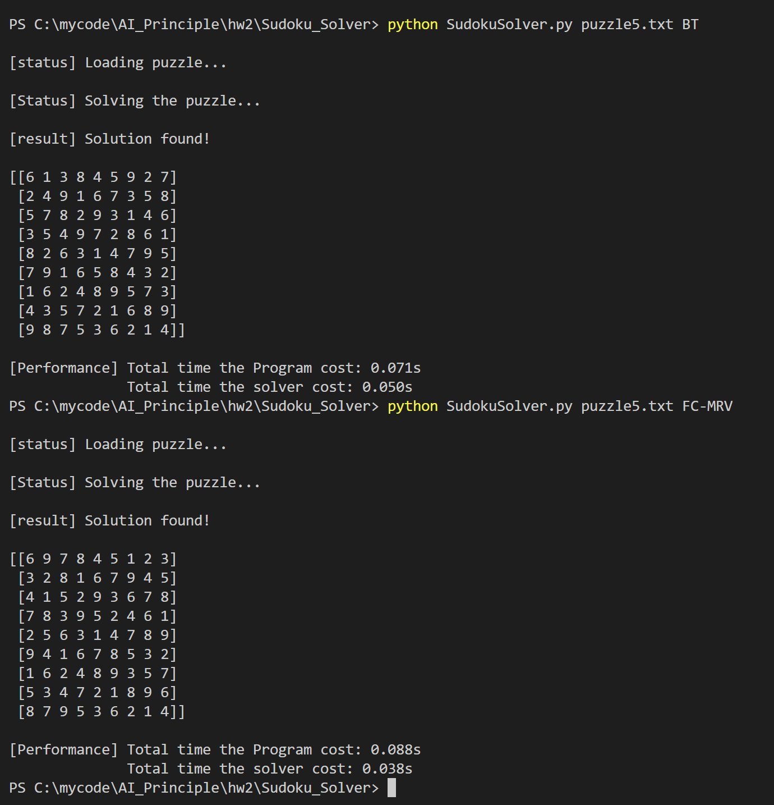
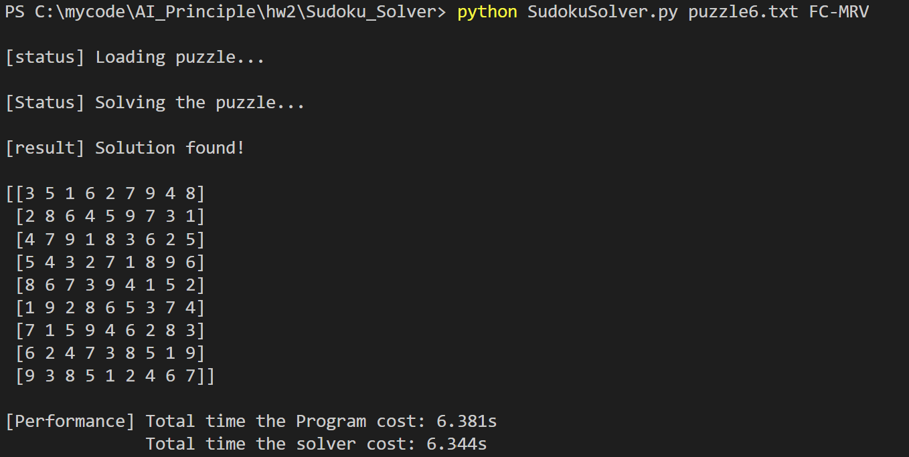

# 中山大学数据科学与计算机学院本科生实验报告

| 课程名称 | 人工智能原理 | 任课老师     | 林倞     |
| -------- | ------------ | ------------ | -------- |
| 年级     | 17级         | 专业（方向） | 软件工程 |
| 学号     | 17343130     | 姓名         | 徐肯     |

## Assignment 2

### Alpha-Beta pruning

> 极小极大算法是一种在两人游戏中寻找最佳移动的方法。 *Alpha-beta修剪*是一种找到最佳minimax解决方案的方法，同时可以避免搜索不会被选择的动作子树。
>
> 参考资料：http://web.cs.ucla.edu/~rosen/161/notes/alphabeta.html

对于本题目中的原图，我进行了一些修改：用圆形来表示B(博弈中的对手)，使图看起来更加清晰。

进行Alpha-Beta Pruning后的结果如下：



图中标红的就是最终选取的方案，分支标有横杠的就是在搜索过程中Pruning掉的分支。

### Sudoku Solver

> 题目：http://www.cs.toronto.edu/~lyan/csc384/a2/A2Sudoku.pdf

按照题目要求，我使用了如下三种方式来解决数独问题：

+ brute force (exhaustive search) method
+ back-tracking (Constraint Satisfaction Problem (CSP)
+ forward-checking with Mininum Remaining Values (MRV) heuristics 

下面给出每种算法的具体思路和设计流程：

#### brute force

> **暴力搜索**：直接使用穷举来解决数组。

###### 思路

使用递归的方法对于每个空白格穷举所有可能性（1-9），并且不在中途检查正确性。直至递归到全部格子填满后，才验证之前的选择是否正确。

###### 算法具体流程

+ 使用递归函数，结束递归的条件为当前puzzle已填满，并且所填结果满足约束
+ 对于每个空格，利用for循环检查其所有可能性，并继续向下递归

###### 核心代码

```python
def solve_puzzle(puzzle, row, col):
    if row > 8:
        if validate_puzzle(puzzle):
            print("[result] Solution found!\n")
            print(puzzle)
            return True
        return False

    if puzzle[row][col] != 0:
        return solve_puzzle(copy.copy(puzzle), int(row + (col + 1) / 9), (col + 1) % 9)
    
    else: 
        for i in range(1, 10):
            pass_puzzle = copy.copy(puzzle)
            pass_puzzle[row][col] = i
            if solve_puzzle(pass_puzzle, int(row + (col + 1) / 9), (col + 1) % 9):
                return True
```

#### back-tracking（CSP）

> **CSP**：一旦发现某部分赋值不满足约束，便可立即剪枝，不再进一步求精。

###### 思路

类似于深度优先搜索的方法，使用剪枝加回溯的方式，按照一定的顺序递归的对空白格尝试填入数字。与暴力搜索不同，此算法在每一步选择时都对于当前puzzle进行检查，一旦发现递归到某个时刻出现矛盾——数字出现重复而导致无路可走，就进行剪枝，并回溯，不再继续搜索下去。

###### 算法具体流程

- 使用递归函数，结束递归的条件为当前puzzle已填满。**此时填满则肯定完成puzzle，因为之前填的都满足约束**
- 对于每个空格，检查当前空白格的约束，即检查当前可以填入的数字，若有，继续向下递归；否则回溯，返回上一个空白格。

###### 核心代码

```python
def solve_puzzle(puzzle, row, col):
    if row > 8:
        return True 

    if puzzle[row][col] == 0:
        for i in range(1, 10):
            if not is_repeat(puzzle, row, col, i):
                puzzle[row][col] = i
                if solve_puzzle(puzzle, int(row + (col + 1) / 9), (col + 1) % 9):       
                    return True
        puzzle[row][col] = 0
        
    else:
        if solve_puzzle(puzzle, int(row + (col + 1) / 9), (col + 1) % 9):
            return True
    return False
```

#### forward-checking with MRV

> **最少剩余价值启发式**：由于在搜索过程中，选择节点的顺序对于效率有很大影响。MRV选择合法取值最少的变量，也就是选择最少剩余值的变量，通过早期有效剪枝，降低搜索树结点数。

###### 思路

根据MRV的思想，要求首先对于剩余可选择值最少的结点进行拓展，那么对应到数独中，自然就可以想到对于还未进行填写的空白区域，按照其约束（还可以填的值）的数量进行从小到大排序后重复类似于第二种算法的递归搜索。

这种思想也比较类似于我们人真实在解决数独问题的思路，一般都会选择已给信息最多、选择最少，也就是确定性最大的格子先入手。

###### 算法具体流程

+ 首先对于初始数独，统计其每一行、每一列、每一块已经填写的数字
+ 对于所有未填写的空白格，根据其所在的位置，结合上一步的结果，得到该位置还可以选择填的数的个数；统计完毕后进行从小到大排序
+ 对于排好序的空白格序列，取出当前队列中的首个结点，为其分配一个可选的值，同时更新之前的行、列、块统计信息
+ 以递归的方式不断调用自身，重复上一步。每当递归无法进行下去——也就是遇到某个结点无法分配值时，这表明之前的分配错误，则回溯，恢复到之前的状态，对上一个结点尝试另一个不同的可选值。
+ 不断重复，直到找到解或无解。

###### 核心代码

```python
def solve(grids, rows, cols, blocks, num_set):
    if grid_sort(grids, rows, cols, blocks, num_set):
        grid = grids.pop(0)
        for remain_value in grid.remain_values:
            grid.set_number(remain_value)
            update_set(rows, cols, blocks, grid, True)
            if reach_goal(rows, cols, blocks):
                grids.insert(0, grid)
                return True
            
            else:
                if grids:
                    if solve(grids, rows, cols, blocks, num_set):
                        grids.insert(0, grid)
                        return True
                    else:
                        update_set(rows, cols, blocks, grid, False)
                        grid.set_number(0)
                else:
                    update_set(rows, cols, blocks, grid, False)
                    grid.set_number(0)
        grids.insert(0, grid)
        return False   
    else:
        return False
```

##### 程序测试

> 运行环境：Windows 10，Python 3.7.2
>
> 测试数据：题目网站中最后给出的五个Puzzle，以及我在网上找到的一个比较难的数独（具体见testCase文件夹）
>
> 程序运行方式：首先进入`Sudoku_Solver`文件夹中，使用以下命令以运行不同的算法：
>
> + Python SudokuSolver puzzle1.txt BF 
> + Python SudokuSolver puzzle2.txt BT 
> + Python SudokuSolver puzzle3.txt FC-MRV 

##### 算法性能分析与对比

三者性能对比：

**穷举法对于空白格数量多的时候，运算时间呈指数级增长，测试时无法得到最终结果，因此在此处就不赘述了**

###### puzzle1



###### puzzle2



###### puzzle3



###### puzzle4



###### puzzle5



测试样例提供的puzzle似乎都有多个解

可以看到，后两种方法相对于第一种暴力穷举，有了很大的提升。虽然剪枝回溯和MRV方法在时间上相差的不是很大，但MRV还是略微有一点优势。由于测试的五个Puzzle比较简单且解不唯一，使得找到其中任意一解的时间都很快，导致MRV的优势没有体现出来。

因此我在网上找到了一个对于计算机来说都比较难的数独，这个数独即使是使用FC-MRV算法都需要花费不少时间，而使用BT算法则要很久。此时，MRV算法的性能就体现出来了

